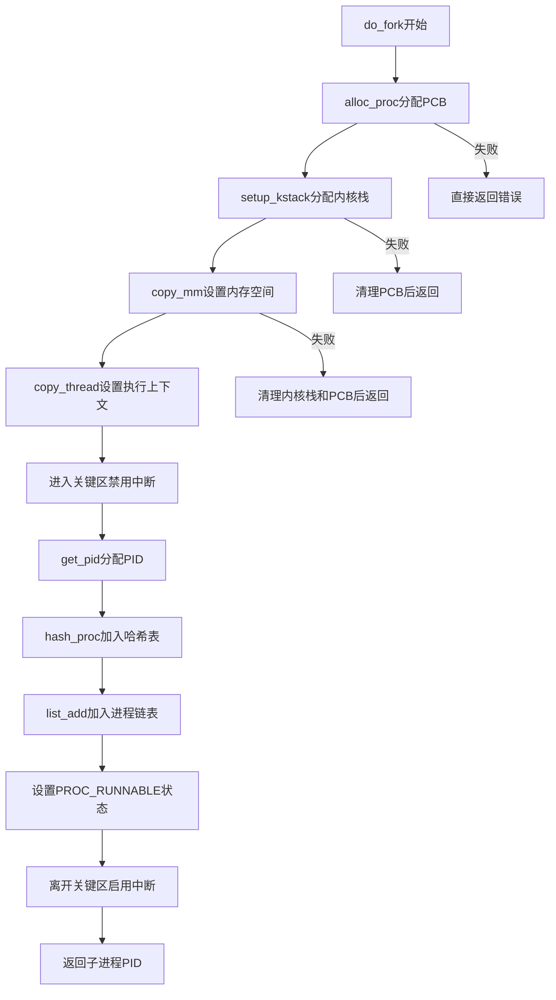

# Lab3实验报告:进程管理

## 练习1：分配并初始化一个进程控制块

这是一个非常完整的实验报告撰写请求，我将根据您提供的代码和头文件定义，为您组织一个结构清晰、重点突出且符合实验要求的报告内容。

### 一、设计实现过程简要说明

本实验任务要求实现 `alloc_proc` 函数，该函数负责分配并初始化 `struct proc_struct` 结构，为创建新进程/线程做准备。

#### 1. 内存分配
首先，使用内核内存分配函数 `kmalloc` 为一个新的 `struct proc_struct` 实例分配内存空间。如果分配成功，则进入初始化阶段。

#### 2. 进程控制块 (`proc_struct`) 初始化逻辑
我采取了“初始化所有字段”的策略，将新分配的进程控制块设置为一个干净、可识别的**未初始化**状态，以便后续的 `proc_init` 或 `do_fork` 流程能够安全地接管并完善它。

| 字段类别 | 初始化字段 | 初始化值/方式 | 目的和作用 |
| :--- | :--- | :--- | :--- |
| **状态/身份** | `state` | `PROC_UNINIT` | 明确标识进程处于未初始化状态。 |
| | `pid` | `-1` | 暂时设为无效值，等待 `get_pid` 分配唯一 PID。 |
| | `runs` | `0` | 运行次数清零。 |
| **内存/堆栈** | `kstack` | `0` | 内核栈地址清零，等待 `setup_kstack` 分配物理页。 |
| | `mm` | `NULL` | 内存管理结构指针清空，表明暂无用户地址空间。 |
| | `pgdir` | `boot_pgdir_pa` | 默认指向内核的页目录基址，确保内核代码可运行。 |
| **调度/关系** | `need_resched` | `0` | 默认无需立即调度。 |
| | `parent` | `NULL` | 父进程指针清空。 |
| | `flags` | `0` | 进程标志位清零。 |
| **上下文/命名** | `context` | `memset` 归零 | 进程切换的上下文清零。 |
| | `tf` | `NULL` | 陷阱帧指针清空。 |
| | `name` | `memset` 归零 | 进程名称字符串清空。 |
| **链表节点** | `list_link`, `hash_link` | `list_init` | 初始化进程全局列表和 PID 哈希列表的连接节点。 |

通过上述初始化，`alloc_proc` 为 ucore 调度器和内存管理模块提供了一个标准的、可用的**进程模板**。

**具体初始化实现代码如下所示：**
```C
if (proc != NULL)

    {

        // Initialize all fields to sensible defaults

        proc->state = PROC_UNINIT;

        proc->pid = -1;

        proc->runs = 0;

        proc->kstack = 0;

        proc->need_resched = 0;

        proc->parent = NULL;

        proc->mm = NULL;

        /* zero the saved context */

        memset(&(proc->context), 0, sizeof(struct context));

        proc->tf = NULL;

        /* by default use the boot page directory physical address */

        proc->pgdir = boot_pgdir_pa;

        proc->flags = 0;

        /* clear name */

        memset(proc->name, 0, sizeof(proc->name));

        /* initialize list links */

        list_init(&proc->list_link);

        list_init(&proc->hash_link);

    }
```


---

### 二、`struct context context` 和 `struct trapframe *tf` 成员变量的含义和作用

在 ucore 操作系统中，`struct context context` 和 `struct trapframe *tf` 是实现进程/线程切换和系统调用的核心数据结构。

#### 1. `struct context context`

| 方面 | 说明 |
| :--- | :--- |
| **含义** | 存储了进程在**内核态**执行时，进行**主动进程切换**（如 `schedule()` 调用 `switch_to`）所需保存的**最小寄存器集合**。根据头文件的定义可以看出，它包含 `ra` (返回地址)、`sp` (栈指针) 和 `s0` 到 `s11` (被调用者保存的寄存器)。 |
| **作用** | 用于实现**内核线程**或**进程**之间的**上下文切换**。 |
| | **保存**：当进程 A 调用 `switch_to` 切换到进程 B 时，进程 A 的执行状态（即这些寄存器的值）会被保存到 A 的 `proc->context` 中。 |
| | **恢复**：当进程 A 再次被调度运行时，`switch_to` 会从 A 的 `proc->context` 中加载这些值，使进程 A 从上次停止的内核位置继续执行。 |
| | **新进程**：在 `copy_thread` 中，新进程的 `context.ra` 会被设置为 `forkret` 函数的地址，确保新进程第一次运行时，能够从正确的内核入口点开始执行。 |

#### 2. `struct trapframe *tf`

| 方面 | 说明 |
| :--- | :--- |
| **含义** | 一个**指针**，指向保存在进程**内核栈**上的 `struct trapframe` 结构。`trapframe` 存储了进程在**用户态**执行时，因**中断、异常或系统调用**进入内核态时，CPU或硬件自动或软件保存的**完整的 CPU 状态**（包括用户态所有通用寄存器、程序计数器 `epc` 和状态寄存器 `sstatus` 等）。 |
| **作用** | 用于实现**内核态与用户态的切换**和**状态恢复**。 |
| | **中断/异常处理**：当中断发生时，`tf` 中的信息是内核进行处理的依据。 |
| | **返回用户态**：内核在处理完系统调用或中断后，会使用 `proc->tf` 中的信息（如 `epc` 和用户栈指针）来恢复 CPU 状态，并最终通过 `sret` 指令安全地返回到用户态，让进程从中断前的指令继续执行。 |
| | **创建子进程**：在 `do_fork` 流程中，`copy_thread` 会复制父进程的 `tf` 到子进程的内核栈上，并让子进程的 `proc->tf` 指向它。这使得子进程在调度器第一次运行它时，能够像从系统调用返回一样，开始在用户态执行。 |

---

## 练习2:为新创建的内核线程分配资源

### 一、设计实现过程简要说明

本次实验的核心任务是实现程序分配资源的部分（即`do_fork` 函数），该函数负责克隆当前进程以创建一个新的子进程，并为其分配运行所需的资源和上下文。

`do_fork` 函数的实现遵循了标准的操作系统进程创建流程，概括为以下七个关键步骤，并确保了资源分配的原子性和失败时的清理：

1.  **分配进程控制块（PCB）**：
    * 调用 `alloc_proc()`(即实验一实现的函数) 分配并初始化一个新的 `struct proc_struct`。这是新进程的唯一身份和管理结构。

2.  **分配内核堆栈**：
    * 调用 `setup_kstack(proc)` 为子进程分配独立的、连续的内核堆栈（`KSTACKPAGE` 数量的页）。这是新进程在内核态运行时的专属堆栈空间。
    * 同时，将新进程的 `parent` 指针设置为 `current`，确立父子关系。

3.  **复制内存管理信息**：
    * 调用 `copy_mm(clone_flags, proc)` 处理内存资源。由于本次实验的重点是内核进程，且在代码中 `copy_mm` 默认返回成功，它确保了内核进程与父进程共享内核地址空间。对于用户进程，此步骤将负责复制或共享页表。

4.  **复制执行上下文**：
    * 调用 `copy_thread(proc, stack, tf)` 完成上下文的设置和复制：
        * 将父进程的Trap(陷阱)帧 (`tf`) 复制到新进程的内核栈顶部，并设置 `proc->tf` 指向它。
        * 设置新进程的切换上下文 `proc->context`，将其返回地址 (`ra`) 设置为内核入口函数 `forkret`，栈指针 (`sp`) 设置为 `proc->tf` 的地址。这确保子进程第一次通过调度器运行时，能够从 `forkret` 开始执行，并最终正确地从陷阱帧恢复状态。

5.  **分配 PID 并加入列表**：
    * 调用 `get_pid()` 分配一个全系统唯一的进程 ID。
    * 将 `proc` 添加到全局进程列表 (`proc_list`) 和 PID 哈希表 (`hash_list`) 中，并递增进程计数器 `nr_process`。

6.  **唤醒新进程**：
    * 将新进程的状态设置为 `PROC_RUNNABLE`，使其成为可被调度器选择执行的候选进程。

7.  **返回结果**：
    * 父进程返回新创建的子进程的 PID，表示创建成功。

### 二、思考题回答：ucore 是否做到给每个新 fork 的进程一个唯一的 ID？

**回答：** **是,ucore做到了给每个新 fork 的进程一个唯一的 ID (PID)。**

#### 分析与理由

PID 唯一性的保障机制主要体现在 `do_fork` 函数对 `get_pid()` 的调用及其内部逻辑：

下面是`get_pid()`的原码，可以结合这部分的源码进行详细的分析：
```C
static int
get_pid(void)
{
    // 保证PID 空间一定够大，永不耗尽
    static_assert(MAX_PID > MAX_PROCESS);      

    // 当前遍历到的进程
    struct proc_struct *proc;              
    // 链表头 & 游标    
    list_entry_t *list = &proc_list, *le;      
    // 静态变量：下次可能冲突的起点 & 上次给出的 PID
    static int next_safe = MAX_PID, last_pid = MAX_PID; 

    // 1. 预增量 + 越界回绕
    if (++last_pid >= MAX_PID) {               // 先自增，再检查是否超过上限
        last_pid = 1;                          // 回到最小合法 PID
        goto inside;                           // 直接进入慢速路径（重新校准 next_safe）
    }

    // 2. 是否落在已知安全区间？如果是则跳过下面检查逻辑
    if (last_pid >= next_safe) {               // 如果 last_pid 进入“可能冲突”区间
    inside:                                    
        next_safe = MAX_PID;                   // 先假设冲突会到最大值
    repeat:                                    // 冲突后重试标签
        le = list;
        // 遍历全部进程
        while ((le = list_next(le)) != list) { 
            proc = le2proc(le, list_link);

            // 3. 发现冲突：PID 已被占用
            if (proc->pid == last_pid) {
                // 自增后再检查是否越界
                if (++last_pid >= next_safe) { 
                    // 再次越界就回绕
                    if (last_pid >= MAX_PID)   
                        last_pid = 1;
                    // 重置 next_safe
                    next_safe = MAX_PID;    
                    // 从头重新遍历   
                    goto repeat;              
                }
            }
            // 4. 无冲突：顺便缩小 next_safe，下次跳得更远
            else if (proc->pid > last_pid && next_safe > proc->pid) {
                // 找到更小的“下一次可能冲突”边界
                next_safe = proc->pid;         
            }
        }
    }

    // 5. 返回唯一 PID
    // 此时 last_pid成功保证了全局唯一
    return last_pid;                           
}
```

这段代码使用预增量 + 越界回绕（>= MAX_PID 归 1），并用 next_safe 做区间剪枝：

只要`[last_pid, next_safe)`区间内已知无冲突，就跳过遍历；否则逐进程检查，冲突时递增 + 回绕 + 重试。

依赖编译期 static_assert(MAX_PID > MAX_PROCESS) 保证必能找到空 PID。


1.  **PID 分配机制**：
    * `do_fork` 通过调用 `get_pid()` 来获取 PID。`get_pid()` 函数通过维护一个静态变量 `last_pid` 来尝试顺序分配 PID，范围在 $1$ 到 $MAX\_PID-1$ 之间。

2.  **强制冲突检查**：
    * `get_pid()` 在每次提出新的 `last_pid` 后，都会执行**全面冲突检查**：它会遍历**所有当前活动进程**（通过 `proc_list`），逐一比对这些进程的 PID 是否与新生成的 `last_pid` 冲突。
    * 如果发现冲突 (`proc->pid == last_pid`)，它会递增 `last_pid`，并使用 `goto repeat` 语句，从头开始对**整个进程列表**重新进行冲突检查，直到找到一个未被占用的 ID。

3.  **哈希表的辅助管理**：
    * 分配到唯一的 PID 后，`do_fork` 紧接着调用 `hash_proc(proc)`，将新进程插入到 `hash_list` 中。这个哈希表以 PID 作为索引，保证了系统能快速地、唯一地通过 PID 来访问进程控制块。

**结论**：正是因为 `get_pid` 函数在分配新 PID 之前，在关闭中断的环境下，顺序遍历所有进程，确保 PID 不重复，确保了当前尝试分配的 PID 在系统中是独一无二的，从而保证了每个新创建的进程都能获得唯一的身份标识。


## 练习3:编写proc_run 函数

### 一、设计实现过程说明

#### 问题：
proc_run用于将指定的进程切换到CPU上运行。它的大致执行步骤包括：
- 检查要切换的进程是否与当前正在运行的进程相同，如果相同则不需要切换。
- 禁用中断。你可以使用/kern/sync/sync.h中定义好的宏local_intr_save(x)和local_intr_restore(x)来实现关、开中断。
- 切换当前进程为要运行的进程。
- 切换页表，以便使用新进程的地址空间。/libs/riscv.h中提供了lsatp(unsigned int pgdir)函数，可实现修改SATP寄存器值的功能。
- 实现上下文切换。/kern/process中已经预先编写好了switch.S，其中定义了switch_to()函数。可实现两个进程的context切换。
- 允许中断。


#### 请回答如下问题：
1. 在本实验的执行过程中，创建且运行了几个内核线程？
2. 完成代码编写后，编译并运行代码：make qemu


#### 实现的代码：
```c
void
proc_run(struct proc_struct *proc) {
    if (proc != current) {
                // LAB4:2310421
        bool intr_flag;
        struct proc_struct *prev = current, *next = proc;

        // 关中断，保证下面这段切换过程不会被打断
        local_intr_save(intr_flag);
        {
            // 1. 更新当前进程指针
            current = next;

            // 2. 切换页表（SATP），使用新进程的地址空间
            lsatp(next->pgdir);

            // 3. 进行上下文切换
            switch_to(&(prev->context), &(next->context));
        }
        // 重新打开中断
        local_intr_restore(intr_flag);
    }
}
```


#### 说明：
`if (proc != current) { ... }`  
首先检查是否需要切换，如果目标进程（proc）就是当前正在运行的进程（current），则无需任何操作，直接返回，从而避免无意义的切换开销。

`bool intr_flag;`  
`struct proc_struct *prev = current, *next = proc;`  
接着，定义了一些变量：
- intr_flag：用于保存中断的状态（开启 / 关闭），后续用于恢复中断。
- prev：指向 “当前进程”（切换前正在运行的进程）。
- next：指向 “目标进程”（即将切换到的进程）。

`local_intr_save(intr_flag);`  
然后，关闭中断，关中断的原因是进程切换是一个不能被打断的操作。如果切换过程中被中断（比如时钟中断、IO 中断），可能导致前一个进程的状态没保存完，后一个进程的状态没恢复完，最终 CPU 寄存器状态混乱，进程无法正常运行。（local_intr_save 是内核提供的宏，作用是关闭当前 CPU 的中断，并将关闭前的中断状态（是否开启）保存到 intr_flag 中。）

`current = next;`  
更新当前进程指针，将其更新为目标进程（next），完成逻辑上的当前进程切换。

`lsatp(next->pgdir);`  
切换页表。（lsatp 是架构相关的函数，对应设置 SATP 寄存器，作用是将 CPU 的页表寄存器更新为目标进程的页表基地（next->pgdir））

`switch_to(&(prev->context), &(next->context));`  
切换上下文，通过switch_to函数保存前一个进程（prev）的 CPU 寄存器状态到 prev->context 中（比如当前的 PC、SP、寄存器值），并从目标进程（next）的 next->context 中恢复寄存器状态（将 PC 设置为 next 进程上次暂停时的指令地址，SP 设置为 next 的栈指针等）。（struct proc_struct 中的 context 成员是进程上下文，存储了进程运行所需的 CPU 寄存器状态）

`local_intr_restore(intr_flag);`  
最后，恢复中断，用之前保存的 intr_flag 恢复中断状态。

### 二、在本实验的执行过程中，创建且运行了几个内核线程？
在本实验的执行过程中，创建且运行了 **2个内核线程**，分别为 `idleproc`（pid=0）和 `initproc`（pid=1），具体信息如下：

### 1. 内核线程：idleproc（pid=0）
- **创建过程**：在 `proc_init()` 函数中，通过 `alloc_proc()` 函数分配进程控制块（proc_struct），手动完成初始化。
- **初始化**：
  - 手动设置 `pid = 0`（系统首个进程/线程）；
  - 状态配置为 `PROC_RUNNABLE`（可运行状态）；
  - 内核栈 `kstack` 绑定为 `bootstack`（系统启动时的引导栈）；
  - 进程名设置为 `"idle"`。
- **作用**：系统初始化完成后，在 `cpu_idle()` 函数中进入死循环，持续执行调度逻辑，负责调度其他可运行进程/线程，始终存在且不退出。

### 2. 内核线程：initproc（pid=1）
- **创建时机与方式**：在 `proc_init()` 函数中，通过 `kernel_thread(init_main, "Hello world!!", 0)` 调用创建。
- **核心初始化配置**：
  - `kernel_thread` 内部调用 `do_fork` 函数生成新进程，最终分配 `pid = 1`；
  - 通过 `set_proc_name(initproc, "init")` 将进程名设为 `"init"`；
  - 绑定执行函数 `init_main`，运行时会打印 `this initproc, pid = 1, name = "init"` 等信息。
- **核心作用**：系统首个有功能的内核线程，负责完成内核子系统的后续初始化工作，是用户进程的“父进程”样例。

### 三、实验结果


## 扩展练习 Challenge

### 1、local_intr_save(intr_flag) 和 local_intr_restore(intr_flag) 是怎样实现开关中断的？

相关宏定义在 `kern/sync/sync.h` 中，核心代码如下：

```c
static inline bool __intr_save(void) {
    if (read_csr(sstatus) & SSTATUS_SIE) {
        intr_disable();
        return 1;
    }
    return 0;
}

static inline void __intr_restore(bool flag) {
    if (flag) {
        intr_enable();
    }
}

#define local_intr_save(x) \
    do {                   \
        x = __intr_save(); \
    } while (0)

#define local_intr_restore(x) __intr_restore(x)
```

RISC-V 用 `sstatus` 寄存器里的 **SIE 位** 来控制当前特权级是否响应中断：

- SIE = 1：允许响应中断；
- SIE = 0：不响应中断。

`intr_disable()` 和 `intr_enable()` 本质上就是把 `sstatus` 里的 SIE 位清零或置一。

在这个前提下，可以把 `local_intr_save` / `local_intr_restore` 看成一对“进入临界区前后保护中断状态”的工具。

#### （1）local_intr_save(intr_flag) 

`local_intr_save(intr_flag)` 宏会调用 `__intr_save()`，并把返回值写进变量 `intr_flag`。它的执行过程可以分成两种情况：

1. **当前是开中断：**

   ```c
   if (read_csr(sstatus) & SSTATUS_SIE) {
       intr_disable();
       return 1;
   }
   ```

   - 先读取 `sstatus`，发现 SIE = 1，说明现在是开中断；
   - 调用 `intr_disable()` 把中断关掉；
   - 返回 1，表示“进入这段代码之前是开中断”。

   这时 `intr_flag` 会被设置为 1。

2. **当前已经是关中断：**

   ```c
   return 0;
   ```

   - `__intr_save()` 不再修改任何寄存器，直接返回 0；
   - `intr_flag` 被设置为 0，表示“进入之前就是关中断”。

这样，从 `local_intr_save(intr_flag)` 执行完成开始，到后面调用 `local_intr_restore(intr_flag)` 之前，中断都处于关闭状态。也就是说，包在这对宏中间的代码可以认为不会被中断打断，适合做需要原子性的一些内核操作。

#### （2）local_intr_restore(intr_flag) 

`local_intr_restore(intr_flag)` 会把 `intr_flag` 传给 `__intr_restore()`：

```c
static inline void __intr_restore(bool flag) {
    if (flag) {
        intr_enable();
    }
}
```

可以分两种情况理解：

1. 如果 `intr_flag == 1`，说明在进入临界区之前，中断本来就是开的，并且在 `__intr_save()` 中被关掉了。此时 `__intr_restore()` 会调用 `intr_enable()` 把 SIE 位重新置为 1，恢复到“开中断”的状态。

2. 如果 `intr_flag == 0`，说明进入临界区之前就已经是关中断，`__intr_save()` 没有改变中断状态。为了不打乱外层代码的逻辑，`__intr_restore()` 在这种情况下不会去开启中断，而是保持当前的关闭状态。


### 2、深入理解不同分页模式的工作原理

`get_pte()` 用来在多级页表中找到一个虚拟地址对应的页表项位置，它的定义在 `kern/mm/pmm.c` 中。关键部分如下：

```c
pte_t *get_pte(pde_t *pgdir, uintptr_t la, bool create) {
    pde_t *pdep1 = &pgdir[PDX1(la)];
    if (!(*pdep1 & PTE_V)) {
        struct Page *page;
        if (!create || (page = alloc_page()) == NULL) {
            return NULL;
        }
        set_page_ref(page, 1);
        uintptr_t pa = page2pa(page);
        memset(KADDR(pa), 0, PGSIZE);
        *pdep1 = pte_create(page2ppn(page), PTE_U | PTE_V);
    }

    pde_t *pdep0 = &((pde_t *)KADDR(PDE_ADDR(*pdep1)))[PDX0(la)];
    if (!(*pdep0 & PTE_V)) {
        struct Page *page;
        if (!create || (page = alloc_page()) == NULL) {
            return NULL;
        }
        set_page_ref(page, 1);
        uintptr_t pa = page2pa(page);
        memset(KADDR(pa), 0, PGSIZE);
        *pdep0 = pte_create(page2ppn(page), PTE_U | PTE_V);
    }

    return &((pte_t *)KADDR(PDE_ADDR(*pdep0)))[PTX(la)];
}
```

可以看到，对 `pdep1` 和 `pdep0` 的处理方式几乎一样，只是用的索引宏不同（`PDX1`、`PDX0`），最后再用 `PTX` 取出最终的 PTE。

#### （1）为什么会出现两段非常相似的代码？

这和 RISC-V 不同分页模式的结构有关。以本实验使用的 Sv39 为例，虚拟地址被拆成三段 VPN：

- VPN[2]：第一级页目录（对应代码里的 `PDX1(la)`）；
- VPN[1]：第二级页目录（对应 `PDX0(la)`）；
- VPN[0]：第三级页表（对应 `PTX(la)`）。

访问一个虚拟地址时，硬件和软件做的事情其实都遵循同一个“套路”：

1. 先用最高那一段 VPN 去访问第一级页目录；
2. 目录项有效的话，得到下一级页表的物理地址；如果这个目录项无效，而软件希望支持按需创建，就需要先分配一页新的页表，并清零；
3. 再用第二段 VPN 去访问下一级目录或页表；
4. 最后用最后一段 VPN 去访问最终的 PTE。

也就是说，**每往下一层，都是同样的一步：根据索引找到当前层的表项，如果需要就分配一页新的页表，然后继续往下。**

在 Sv32 中只有两级页表，整个过程需要一段这样的逻辑；在 Sv39 中有三级，就会出现两段几乎一样的代码；在 Sv48 中有四级，代码中类似的结构会更多。不同分页模式的差别主要在“有几级”和“每一段 VPN 有多宽”，而不是在“每一层的处理方式”。

所以 `get_pte()` 里出现两段几乎一样的代码，其实就是多级页表结构的直接反映：第一级和第二级目录在软件层面需要做的工作都是“检查表项是否有效，如果无效且允许创建，就分配一页新的页表”。

#### （2）这两段代码分别在做什么？

可以按“从外到内”的顺序来理解：

1. **处理第一级目录（VPN[2]）**

   - 用 `PDX1(la)` 在 `pgdir` 这页中找到对应的目录项 `pdep1`；
   - 如果 `*pdep1` 无效（没有设置 `PTE_V`），说明这一段虚拟地址还没有对应的二级目录页表；
   - 当 `create == 1` 时，就调用 `alloc_page()` 分配一页物理内存，把这一页清零，然后通过 `pte_create` 把这页的物理页号写入 `pdep1`，并设置 `PTE_V` 等标志；
   - 这样，`pdep1` 就指向了一张新的“二级目录页表”。

2. **处理第二级目录（VPN[1]）**

   - 通过 `PDE_ADDR(*pdep1)` 取出 `pdep1` 指向页表的物理地址，再用 `KADDR` 转成内核虚拟地址，得到一个 `pde_t *` 类型的指针；
   - 用 `PDX0(la)` 在这张页表里找到第二级目录项 `pdep0`；
   - 如果 `*pdep0` 无效，且 `create == 1`，就再分配一页作为第三级页表页，同样清零并写入 `pdep0`；
   - 这样，`pdep0` 就指向了最终的“三级页表页”。

3. **返回第三级页表中的条目地址**

   - 再用 `PDE_ADDR(*pdep0)` 找到第三级页表页的物理地址，通过 `KADDR` 转成虚拟地址；
   - 用 `PTX(la)` 在该页里找到具体的 PTE 条目；
   - 把这个条目的地址作为返回值交给上层函数（比如 `page_insert`）使用。

整个过程就是“沿着 VPN[2] → VPN[1] → VPN[0] 这三级索引一路走下去，如果中间某一级不存在，就按需要分配并初始化一页新的页表页”，所以会自然形成两段结构完全相似的代码。

#### （3）现在的 get_pte 写法好不好？要不要把“查找”和“分配”拆开？

从接口上看，`get_pte(pgdir, la, create)` 同时承担了两个角色：

1. **查找角色**：当 `create == 0` 时，只负责沿着多级页表查找，任何一级缺失都会直接返回 `NULL`；
2. **分配角色**：当 `create == 1` 时，如果途中发现目录项无效，就自动分配新的页表页，把路径补齐。

这种合并写法有一些优点，也有一些缺点。

**优点：**

- 上层调用很方便。  
  例如在 `page_insert()` 里，只需要写：

  ```c
  pte_t *ptep = get_pte(pgdir, la, 1);
  ```

  就能保证路径上的目录页表全部准备好，不用在 `page_insert` 里反复判断“这一层有没有页表，要不要先 alloc 一下”。

- 对于本实验这种“预先建立映射”的场景来说，非常直接，代码量也更少，有利于理解整体流程。

**缺点：**

- 函数的职责不够单一。  
  有时候调用者只想“看看当前有没有映射”，并不希望顺带创建新的页表页。虽然可以通过 `create == 0` 来控制，但函数名叫 `get_pte`，不看参数的话很容易误以为它总是“保证有一个 PTE”。

- 调试和扩展时不够灵活。  
  如果后面要引入缺页异常、按需建表、统计页表页分配次数等功能，把“查找”和“分配”分成两个函数会更清楚。例如可以设计：
  - `pte_t *find_pte(pgdir, la)`：只查找，不分配。
  - `pte_t *get_or_create_pte(pgdir, la)`：在需要写映射时使用，找不到就自动分配。

综合来看，以当前 Lab 的规模和目的来说，把查找和分配写在一个函数中是可以接受的，优点是实现简单、调用方便。  
如果以后在这个内核基础上继续扩展，或者希望页表管理模块更清晰、更易于维护，那么把“纯查找”和“查找 + 分配”拆开成两个接口，会更加合理。


## 重要知识点

### 实验运行核心知识点：系统初始化与双重虚拟化

#### I. 系统总控流与虚拟化层级
1. **总控起点 (`init` 函数)**：
    * **定义**：`init` 函数是 ucore 内核的起点，负责**串行**地完成所有核心组件的初始化工作。
    * **流程**：初始化流程遵循严格的层级依赖关系，从底层资源管理（内存）到上层执行流管理（进程/线程）。
    * **顺序**：`pmm_init` (物理内存) $\rightarrow$ 中断/异常初始化 $\rightarrow$ `vmm_init` (虚拟内存) $\rightarrow$ `proc_init` (进程)。

2. **内存虚拟化 (`pmm_init` $\rightarrow$ `vmm_init`)**：
    * **`pmm_init` (物理内存)**：负责建立**空闲物理页管理机制**（如 Buddy System），这是后续所有内存分配（页表、线程栈）的基础。
    * **`vmm_init` (虚拟内存)**：在此基础上建立**内核页表结构**，完成内核地址空间的虚拟地址到物理地址的**静态映射**，使内核能够使用虚拟地址访问内存。

3. **控制流转换 (CPU 虚拟化)**：
    * **目的**：在完成内存的虚拟化后，系统仍是**单条控制流**。`proc_init` 的目的是引入 **CPU 虚拟化**，使多条控制流（线程）能够**分时并发**执行。

#### II. 进程管理初始化 (`proc_init`)
1. **进程管理初始化**：
    * **函数**：调用 `proc_init` 函数，完成进程管理所需数据结构的初始化（如进程列表、PID 计数器等）。
    * **核心任务**：创建两个特殊的内核线程。

2. **核心线程定义**：
    * **idleproc (PID 0)**：
        * **定义**：系统启动后的**占位线程**（Placeholder Thread）。
        * **作用**：当系统中**没有其他可运行的线程**时，`idleproc` 的唯一任务是进入 `cpu_idle()` 空闲循环，等待中断或事件唤醒其他线程。
    * **initproc (PID 1)**：
        * **定义**：通过 `kernel_thread` 创建的**第一个实际执行任务**的内核线程。
        * **作用**：在本实验中，它的任务是执行 `init_main` 函数，验证内核线程的创建与调度机制是否正确（通过输出 "Hello World"）。

#### III. 首次调度与执行流程
1. **初始化结束后的执行者**：
    * 在 `proc_init` 完成后，当前执行线程仍是 `idleproc`。

2. **进入调度循环**：
    * `idleproc` 随后运行 `cpu_idle()` 函数。
    * `cpu_idle()` 会不断调用 **`schedule()`** 函数。

3. **线程切换**：
    * **`schedule()`**：调度器负责选择下一个处于 **可运行状态 (`PROC_RUNNABLE`)** 的线程。在初次调度时，它会选择刚刚创建的 `initproc`。
    * **线程切换**：系统执行 **线程切换操作**（通过 `switch_to` 和 `proc_run`），将 CPU 的执行权从 `idleproc` 转移给 `initproc`。

4. **任务执行**：
    * **结果**：`initproc` 获得 CPU 执行权，开始执行其分配的任务（`init_main`），从而输出 “Hello World”，标志着进程创建和调度机制的正确性得到验证。

---


### Sv39 页表操作宏与常量 (`kern/mm/mmu.h`)

这段代码定义了 RISC-V Sv39 模式下，用于**分解虚拟地址**和**操作页表项 (PTE)** 的关键工具。

#### I. 虚拟地址（Linear Address）分解宏

这些宏用于将 39 位的虚拟地址 (`la`) 分解为三级页表索引和页内偏移量。Sv39 虚拟地址结构为：$38:30$ 位是 VPN[2] (PDX1)，$29:21$ 位是 VPN[1] (PDX0)，$20:12$ 位是 VPN[0] (PTX)。

| 宏名称 | 作用 | 对应位域 | 计算原理 |
| :--- | :--- | :--- | :--- |
| **`PDX1(la)`** | 提取**第一级页目录索引** (VPN[2]) | 38:30 | `la >> PDX1SHIFT (30)` & `0x1FF (9 bits)` |
| **`PDX0(la)`** | 提取**第二级页目录索引** (VPN[1]) | 29:21 | `la >> PDX0SHIFT (21)` & `0x1FF (9 bits)` |
| **`PTX(la)`** | 提取**页表项索引** (VPN[0]) | 20:12 | `la >> PTXSHIFT (12)` & `0x1FF (9 bits)` |
| **`PPN(la)`** | 提取**虚拟页号** (VPN[2:0]) | 38:12 | 将地址右移 `PTXSHIFT (12)` 位，即整个页号。|
| **`PGOFF(la)`** | 提取**页内偏移量** | 11:0 | `la` & `0xFFF` (页大小 $4096$ 的掩码) |

#### II. 地址重构与页表地址提取宏

这些宏用于构造虚拟地址或从页表项中提取下一个页表的物理地址。

| 宏名称 | 作用 | 应用场景 | 关键点 |
| :--- | :--- | :--- | :--- |
| **`PGADDR(d1, d0, t, o)`** | **重构虚拟地址** | 将三级页目录索引 (`d1`, `d0`), 页表索引 (`t`) 和页内偏移 (`o`) 组合成一个 64 位虚拟地址。| 通过左移对应移位量 (`PDX1SHIFT`, `PDX0SHIFT`, `PTXSHIFT`) 后进行按位或操作。 |
| **`PTE_ADDR(pte)`** | **从 PTE 中提取下一级页表的物理地址** | 在多级页表中，PTE 存储的是下一级页表的物理地址（或最终页的物理地址）。| `(pte & ~0x3FF)` 清除了 PTE 中的低 10 位标志位。 $\rightarrow$ **关键：** 提取 PTE 中的 PPN 字段，并将其左移得到物理地址。 |
| **`PDE_ADDR(pde)`** | **从 PDE 中提取下一级页表的物理地址** | 作用同 `PTE_ADDR`，只是名称不同，用于语义区分。 | 同样清除低 10 位标志位，并转换 PPN 为物理地址。 |

#### III. 关键常量与移位量定义

这些常量定义了 Sv39 模式下的页表结构尺寸和地址分解所依赖的移位量。

| 常量名称 | 值 | 含义及应用 |
| :--- | :--- | :--- |
| **`PGSIZE`** | $4096$ | 页面的大小（以字节计）。 |
| **`PGSHIFT`** | $12$ | $\log_2(\text{PGSIZE})$，用于页内偏移的位移。 |
| **`NPTEENTRY`** | $512$ | 每级页表（页目录）中的条目数量（$2^9$），对应 9 位的索引。 |
| **`PTXSHIFT`** | $12$ | PTE 索引 (VPN[0]) 在虚拟地址中的**最低**起始位。 |
| **`PDX0SHIFT`** | $21$ | PDX0 索引 (VPN[1]) 在虚拟地址中的起始位（$12 + 9$）。 |
| **`PDX1SHIFT`** | $30$ | PDX1 索引 (VPN[2]) 在虚拟地址中的起始位（$21 + 9$）。 |
| **`PTE_PPN_SHIFT`** | $10$ | 页表项 (PTE) 中 **PPN 字段** 相对于 PTE **最低位**的起始位（因为低 10 位用于标志位）。 |

#### IV. 页表项 (PTE) 标志位定义

这些常量定义了页表项低 10 位（Sv39 模式）中存储的权限和状态标志位。

| 宏名称 | 值 | 含义 |
| :--- | :--- | :--- |
| **`PTE_V`** | `0x001` | **Valid (有效)**：该 PTE 是有效的，可用于地址翻译。 |
| **`PTE_R`** | `0x002` | **Read (读)**：允许读访问（设置该位，并 `PTE_V` 必须设置）。 |
| **`PTE_W`** | `0x004` | **Write (写)**：允许写访问（设置该位，并 `PTE_R` 必须设置）。 |
| **`PTE_X`** | `0x008` | **Execute (执行)**：允许执行访问。 |
| **`PTE_U`** | `0x010` | **User (用户)**：该页映射可供 U-Mode（用户模式）访问。 |
| **`PTE_A`**, **`PTE_D`**, **`PTE_G`** | (代码中未给出具体值，但已保留位置) | **Accessed**, **Dirty**, **Global** 等标志位，用于内存管理策略。 |

---

### Sv39 虚拟内存管理关键知识点（`page_insert` & `page_remove`）

#### I. 核心映射接口功能 (`page_insert` & `page_remove`)

| 接口名称 | 目的 | 核心操作 | 依赖函数 |
| :--- | :--- | :--- | :--- |
| **`page_insert`** | **在页表里建立一个映射**。将虚拟地址 `la` 映射到物理页面 `page`。 | 1. 查找或分配页表项 (`ptep`)。2. 更新 `page` 的引用计数。3. 处理**旧映射**（如果有）。4. 构造新的 PTE 并写入。5. 刷新 TLB。 | `get_pte()`, `page_ref_inc()`, `page_remove_pte()`, `pte_create()`, `tlb_invalidate()` |
| **`page_remove`** | **在页表里删除一个映射**。解除虚拟地址 `la` 与其对应物理页面的绑定。| 1. 查找页表项 (`ptep`)。2. 如果找到且有效，调用 `page_remove_pte` 进行实际的删除和资源释放。| `get_pte()`, `page_remove_pte()` |

#### II. 资源分配与 PTE 查找 (`get_pte`)

`get_pte(pgdir, la, create)` 是实现多级页表遍历和按需分配页表页的核心函数。

1. **三级页表遍历机制**：
    * **步骤 A：PDX1 (Giga Page 级别)**：首先通过 `PDX1(la)` 定位到第一级页目录项 `*pdep1`。
    * **按需分配**：如果 `*pdep1` 无效 (`!(*pdep1 & PTE_V)`) 且 `create=true`：
        * 分配一个新的物理页面 (`alloc_page()`) 作为下一级页表。
        * 设置该页面的引用计数为 1 (`set_page_ref(page, 1)`)。
        * **清零**：通过 `memset(KADDR(pa), 0, PGSIZE)` **清零**新分配的页表页内容，以确保地址翻译是干净的（防止旧数据残留）。
        * **构造 PDE**：构建新的 PDE (`*pdep1`)，指向新页表页的 PPN，并设置 **`PTE_U | PTE_V`** 标志。
    * **步骤 B：PDX0 (Mega Page 级别)**：通过 `PDX0(la)` 进一步定位到第二级页目录项 `*pdep0`。
    * **步骤 C：PTX (Page Table 级别)**：遍历逻辑与 PDX1 级别**完全一致**，用于定位到最终的页表项 `*ptep`。

2. **物理地址访问**：
    * 在遍历过程中，一旦从 PDE 中提取出下一级页表的物理地址 (`PDE_ADDR(*pdep1)`)，必须通过 **`KADDR()`** 宏将其转换为**内核虚拟地址**才能在内核代码中进行访问和操作（如 `memset` 或索引下一级页表项）。

#### III. 映射建立逻辑 (`page_insert` 功能模块)

`page_insert` 处理了建立新映射时可能遇到的三种情况，确保资源管理正确无误：

1. **查找页表项**：调用 `get_pte(pgdir, la, 1)`，确保目标 PTE 存在。
2. **增加引用计数**：`page_ref_inc(page)`，即使目标物理页已存在映射，也要先增加引用计数。
3. **处理旧映射**：
    * **Case 1: PTE 无效** (`!(*ptep & PTE_V)`)：无需处理，直接进入步骤 4。
    * **Case 2: 映射相同** (`pte2page(*ptep) == page`)：新旧映射指向同一物理页，只需将第 2 步增加的引用计数减回 (`page_ref_dec(page)`)，然后直接更新权限。
    * **Case 3: 映射不同** (`pte2page(*ptep) != page`)：虚拟地址 `la` 原本映射到**另一物理页**。必须先调用 `page_remove_pte` 删除旧映射并释放旧资源，再进入步骤 4。
4. **写入新 PTE**：`*ptep = pte_create(page2ppn(page), PTE_V | perm)`，使用新物理页面的 PPN 和指定的权限 (`perm`) 构造 PTE。
5. **TLB 刷新**：`tlb_invalidate(pgdir, la)`，通知硬件 TLB 缓存失效，确保下次访问 `la` 时使用新的映射。

#### IV. 映射删除与资源释放 (`page_remove_pte` 功能模块)

`page_remove_pte` 是实际执行解映射和物理内存回收的核心逻辑。

1. **有效性检查 (1)**：`if (*ptep & PTE_V)`，确保页表项是有效的映射。
2. **提取页面信息 (2)**：`struct Page *page = pte2page(*ptep)`，通过 PTE 找到对应的 `struct Page` 结构。
3. **引用计数管理 (3)**：`page_ref_dec(page)`，将该物理页面的引用计数减一。
4. **物理页回收 (4)**：`if (page_ref(page) == 0) { free_page(page); }`，如果引用计数降为 0，则表明**不再有任何虚拟地址映射到该物理页**，安全地将其归还给空闲页链表。
5. **清除 PTE (5)**：`*ptep = 0`，将页表项清零，彻底删除映射。
6. **TLB 刷新 (6)**：`tlb_invalidate(pgdir, la)`，通知硬件 TLB 缓存失效。

#### V. 权限安全与重映射考量

1. **Giga Page 映射安全隐患**：
    * **问题**：在 `entry.S` 中，最初使用单个 Giga Page 映射内核的各个段（`.text`, `.data`, `.bss`），并赋予了相同的权限（例如 `W=1`）。
    * **后果**：这导致 `.text` (代码段) 在逻辑上不可写，但在页表映射中却被赋予了可写权限，存在**安全隐患**。
2. **精细化重映射需求**：
    * **目标**：为内核各段（`.text`, `.rodata`, `.data`, `.bss`）分别设置**正确的访问权限**（R/W/X），以增强系统安全性和稳定性。
    * **实现方式**：
        * **放弃旧页表**：由于原 Giga Page 映射存在于一个简单的页表中，最简单的方法是**放弃现有页表**，创建新的页表 (`boot_pgdir` 或其他)。
        * **新建页表**：在新页表中，对内核的各个段进行**逐一映射**，并设置其精确的 `PTE_R`、`PTE_W`、`PTE_X` 标志。
        * **切换 SATP**：将 **`satp` 寄存器**指向新的页表基址，完成虚拟地址空间的重映射切换。


---

### 虚拟内存核心函数实现逻辑分析

#### I. `get_pte(pgdir, la, create)`：页表项查找与分配

`get_pte` 是多级页表机制的基础，它负责从页目录 (`pgdir`) 开始，沿着虚拟地址 `la` 的索引路径，找到最终的页表项 (`pte`) 地址。

##### 1. 多级遍历与按需分配（Sv39 三级页表）

`get_pte` 函数实现了 RISC-V Sv39 三级页表的遍历，逻辑在 PDX1 和 PDX0 级别完全一致：

| 级别 | 索引宏 | 页表指针 | 逻辑 |
| :--- | :--- | :--- | :--- |
| **PDX1 (Giga Page)** | `PDX1(la)` | `pdep1` | 检查 `*pdep1` 的 **`PTE_V`** (有效位)。 |
| **PDX0 (Mega Page)** | `PDX0(la)` | `pdep0` | 检查 `*pdep0` 的 **`PTE_V`** (有效位)。 |
| **PTX (Page Table)** | `PTX(la)` | **返回** | 找到最终的 PTE 指针。 |

##### 2. 关键分配逻辑

如果某一级页目录项 (`*pdep1` 或 `*pdep0`) 无效（下一级页表不存在）：

* **创建判断**：首先检查 `create` 参数。如果 `create` 为 `false`（只查找），或者无法分配物理页面 (`alloc_page() == NULL`)，则立即返回 `NULL`。
* **物理页分配**：调用 `alloc_page()` 分配一个物理页面，用于存放下一级页表的内容。
* **引用计数**：`set_page_ref(page, 1)`，将新分配的页表页引用计数设置为 1。
* **清零操作**：`memset(KADDR(pa), 0, PGSIZE)`。
    * **目的**：**至关重要**。确保新的页表页是干净的，所有 PTE/PDE 初始状态都为 0（即无效，防止误映射）。
    * **地址转换**：注意这里必须使用 **`KADDR(pa)`** 将物理地址转换为内核虚拟地址，才能在 C 语言内核中通过指针进行 `memset` 操作。
* **构建 PDE/PTE**：`*pdep1 = pte_create(page2ppn(page), PTE_U | PTE_V)`。
    * **内容**：将新页表的 PPN 写入 PDE，并设置 `PTE_V` (有效) 和 `PTE_U` (用户可访问) 标志。
    * **权限**：注意这里只设置了 `PTE_U | PTE_V`，**R/W/X 权限全部为零**。这意味着这些新分配的页表页本身不允许用户模式访问 R/W/X。

##### 3. 地址转换细节

在遍历过程中，访问下一级页表前，都需要进行两次地址转换：
1.  **提取物理地址**：`PDE_ADDR(*pdep1)` 从 PDE 中取出下一级页表的物理地址。
2.  **转换虚拟地址**：`KADDR(...)` 将该物理地址转换为内核可以直接访问的虚拟地址。
3.  **索引**：将转换后的虚拟地址强制转换为 `pde_t *` 或 `pte_t *`，再用 `[PDX0(la)]` 或 `[PTX(la)]` 索引到目标页表项。

#### II. `page_insert()`：建立映射的核心逻辑

`page_insert` 的核心任务是建立 `la` 到 `page` 的映射，并正确处理原有的映射关系和引用计数。

1.  **查找并确保 PTE 存在**：`ptep = get_pte(pgdir, la, 1)`。如果 `get_pte` 失败（内存不足），则返回错误。
2.  **新物理页引用计数增加**：`page_ref_inc(page)`。总是先增加新物理页面的引用计数，表示现在至少有一个虚拟地址要指向它。
3.  **处理原有映射** (`if (*ptep & PTE_V)`)：
    * **Case A (相同映射)**：如果 `p == page`，表示 `la` 已经映射到该物理页，但可能权限不同。此时需要抵消第 2 步多加的引用计数 (`page_ref_dec(page)`)，然后继续更新权限。
    * **Case B (不同映射)**：如果 `p != page`，表示这是一个**重映射**操作。
        * 必须调用 `page_remove_pte(pgdir, la, ptep)` 来**清理旧映射**（包括旧物理页的引用计数递减和可能的释放）。
        * **注意**：`page_remove_pte` 会将 `*ptep` 清零，但 **`page_insert` 立即在下一步重新设置 `*ptep`**。
4.  **写入新页表项**：`*ptep = pte_create(page2ppn(page), PTE_V | perm)`。
    * 使用新的物理页面 `page` 的 PPN 和用户指定的权限 `perm` 来构造新的页表项并写入。
5.  **TLB 刷新**：`tlb_invalidate(pgdir, la)`。页表发生变化，必须刷新 TLB，确保 CPU 下次访问 `la` 时使用新的映射。

#### III. `page_remove_pte()`：删除映射和回收资源

`page_remove_pte` 是一个内联静态函数，负责单页表项的清理和资源回收，被 `page_insert` 和 `page_remove` 调用。

1.  **有效性检查 (1)**：`if (*ptep & PTE_V)`，只处理有效的映射。
2.  **获取对应物理页 (2)**：`struct Page *page = pte2page(*ptep)`，通过 PTE 找到被映射的物理页面。
3.  **引用计数递减 (3)**：`page_ref_dec(page)`，减少该物理页面上的一个引用计数。
4.  **条件释放 (4)**：`if (page_ref(page) == 0) { free_page(page); }`。
    * 这是**物理内存回收**的核心逻辑。只有当页面的引用计数降为零时（即**没有任何虚拟地址**再指向它），才将其释放回物理内存管理系统。
5.  **清除 PTE (5)**：`*ptep = 0`，逻辑上断开映射关系。
6.  **TLB 刷新 (6)**：`tlb_invalidate(pgdir, la)`，通知硬件 TLB 缓存失效。

#### IV. `check_pgdir()`：测试流程分析

`check_pgdir` 是一个系统的**集成测试**，用于验证 `alloc_page`、`page_insert`、`get_pte`、`page_ref` 和 `page_remove` 等函数的协同工作是否正确。

| 步骤 | 虚拟地址 (la) | 物理页 | 操作 | 验证的关键点 |
| :--- | :--- | :--- | :--- | :--- |
| **A** | `0x0` | `p1` | **第一次插入** (`page_insert`) | `get_pte` 成功找到 PTE；`pte2page` 映射正确；`page_ref(p1) == 1`。 |
| **B** | `PGSIZE` | `p2` | **第二次插入** (`page_insert`) | `get_pte` 成功分配了 PDX0 级页表；新映射 `p2` 权限 (`PTE_U | PTE_W`) 正确；`page_ref(p2) == 1`。 |
| **C** | `PGSIZE` | `p1` | **重映射** (`page_insert`) | `page_ref(p1)` 从 1 变为 2；`page_ref(p2)` 从 1 变为 0（因为 `page_remove_pte` 被调用并释放了 `p2`）；`PGSIZE` 现在映射到 `p1`，权限更新为 0。 |
| **D** | `0x0` | `p1` | **第一次移除** (`page_remove`) | `page_ref(p1)` 从 2 变为 1；`p1` 没有被释放。 |
| **E** | `PGSIZE` | `p1` | **第二次移除** (`page_remove`) | `page_ref(p1)` 从 1 变为 0；`p1` 被释放。 |
| **F** | N/A | 页目录 | **页表页清理** | 验证 PDX0 级页表（由 `boot_pgdir[0]` 指向）的引用计数为 1，并手动释放它，最后清除 `boot_pgdir[0]` 的入口，完成所有痕迹清理。 |

通过这一系列断言，测试确保了：页面分配、映射建立、权限设置、重映射清理、引用计数增减、页面回收、映射删除等所有核心功能都按预期工作。

### `kernel_thread`函数的作用
- **概述**：kernel_thread函数用于在内核空间中创建一个新的内核线程。该函数是创建内核线程的核心接口，它通过设置陷阱帧（trapframe）来初始化线程的执行环境，并最终调用 do_fork完成实际创建过程。
- 函数原型：`int kernel_thread(int (*fn)(void *), void *arg, uint32_t clone_flags)`
  - fn:线程入口指针；
  - arg:线程入口参数；
  - clone_flags:设置线程的属性，包括是否共享内存空间、是否复制页表等。
  - 成功返回新进程的PID，失败返回错误码。

- **实现**：kernel_thread函数的实现主要分为以下几个步骤：
  1. 初始化陷阱帧
     - 使用 memset清零陷阱帧 tf，确保所有字段初始化为零
     - 设置关键寄存器
       - tf.gpr.s0保存函数指针 fn的地址
       - tf.gpr.s1保存参数 arg的地址，供线程函数使用
     - 设置状态寄存器tf.status
       - 通过 read_csr(sstatus)读取当前值，并添加 SSTATUS_SPP（表示线程起始于内核态）和 SSTATUS_SPIE（允许中断），同时清除 SSTATUS_SIE（禁用中断），确保线程安全进入内核态
     - 设置异常程序计数器 tf.epc为 kernel_thread_entry的地址。这是一个汇编入口点，用于实际跳转到线程函数
  2. 调用 do_fork 创建线程
      - 调用 do_fork(clone_flags | CLONE_VM, 0, &tf)，其中
        - CLONE_VM强制共享内存空间，表明创建的是线程而非独立进程
        - 堆栈参数 stack=0，因为内核线程使用独立内核栈（通过 setup_kstack分配）
        - 陷阱帧 tf被传递，用于在新线程中恢复上下文
       - o_fork会进一步调用 copy_thread将 tf复制到新线程的内核栈顶，并设置上下文中的 ra（返回地址）为 forkret，确保线程首次调度时从 kernel_thread_entry开始执行 
  3. 线程执行流程
     - 新线程启动时，从 tf.epc（即 kernel_thread_entry）开始执行。该入口函数会从 s0和 s1寄存器取出 fn和 arg，并调用 fn(arg)。
     - 线程函数执行完毕后，通过 do_exit退出
     - 若 do_fork失败（如进程数超限或内存不足），返回错误码（负值）
- 在函数中使用位置
  - 用于创建初始化过程中的第二个内核线程。在系统启动时，第一个线程 idleproc（PID=0）创建后，通过 kernel_thread创建 initproc（PID=1）。该线程执行 init_main函数，打印初始化信息


### **copy_mm：复制进程的内存空间**

`copy_mm` 函数的核心职责是根据指定的克隆标志（`clone_flags`），决定子进程如何“继承”父进程的内存空间。其基本逻辑如下：

```c
static int copy_mm(unsigned long clone_flags, struct task_struct *tsk)
{
    struct mm_struct *mm, *oldmm = current->mm; // current是父进程
    // ... 初始化统计字段等 ...
    
    tsk->mm = NULL;
    tsk->active_mm = NULL;

    // 情况1：父进程是内核线程
    if (!oldmm)
        return 0; // 内核线程没有用户空间，直接返回

    // 情况2：设置了CLONE_VM标志（通常用于创建线程）
    if (clone_flags & CLONE_VM) {
        mmget(oldmm); // 增加父进程mm的引用计数
        mm = oldmm;   // 子进程直接共享父进程的mm_struct
        goto good_mm;
    }

    // 情况3：未设置CLONE_VM标志（通常用于fork创建进程）
    retval = -ENOMEM;
    mm = dup_mm(tsk, oldmm); // 复制父进程的地址空间
    if (!mm)
        goto fail_nomem;

good_mm:
    tsk->mm = mm;
    tsk->active_mm = mm;
    return 0;
}
```

**关键实现路径：`dup_mm`**

当需要为子进程创建独立的地址空间时（对应上述情况3），`copy_mm` 会调用 `dup_mm`，这个函数是写时复制（Copy-on-Write, COW）机制实现的关键。其工作可以概括为三步：

1.  **分配结构**：`allocate_mm` 分配一个新的 `mm_struct` 结构体，并通过 `memcpy` 复制父进程 `mm_struct` 的内容。
2.  **初始化页表**：`mm_init` 函数会调用 `mm_alloc_pgd` 为新进程分配页全局目录（PGD），并**复制内核空间的页表项**。这是因为所有进程的内核空间映射都是相同的。
3.  **复制用户空间映射**：`dup_mmap` 函数是核心，它遍历父进程的所有虚拟内存区域（VMA），并为子进程创建对应的VMA。关键在于，它调用 `copy_page_range` 等函数**复制的是页表项（PTE），而非实际的物理页面**。在复制过程中，对于可写且私有的页面，会将父子进程对应页表项的权限设置为**只读**。这样，当任何一方尝试写入时，便会触发缺页异常，内核在异常处理程序（如 `do_wp_page`）中才真正分配新的物理页面并复制数据，这就是“写时复制”。

### **copy_thread：设置陷阱帧和上下文**

`copy_thread` 函数负责初始化子进程第一次被调度执行时所需要的关键数据：**陷阱帧（Trap Frame, `tf`）** 和**进程上下文（Context, `context`）**。这使得子进程能够从一个特定的起点开始运行。

以下是一个概念性的实现逻辑，展示了其主要步骤：

```c
static void copy_thread(struct proc_struct *proc, uintptr_t esp, struct trapframe *tf) {
    // 1. 在子进程内核栈顶分配陷阱帧空间，并复制父进程传递来的模板tf
    proc->tf = (struct trapframe*)(proc->kstack + KSTACKSIZE - sizeof(struct trapframe));
    *(proc->tf) = *tf;

    // 2. 对于子进程（fork情况），令其返回值为0（通过寄存器a0传递）
    proc->tf->gpr.a0 = 0; // 这使子进程在用户态能感知到fork返回0

    // 3. 设置子进程的内核栈指针。若esp为0（内核线程），则使用tf的地址
    proc->tf->gpr.sp = (esp == 0) ? (uintptr_t)proc->tf : esp;

    // 4. 设置上下文中的返回地址和栈指针，用于第一次切换到子进程
    proc->context.ra = (uintptr_t)forkret; // ra: 第一次切换后跳转到的函数
    proc->context.sp = (uintptr_t)(proc->tf); // sp: 内核栈栈顶位置
}
```

**参数与作用分析：**

*   `proc`: 子进程的控制块。
*   `esp`: **用户栈指针**。如果此参数为0，表示创建的是内核线程，它没有用户空间，因此不需要用户栈。
*   `tf`: **陷阱帧模板**。通常由父进程在调用 `kernel_thread` 或进行系统调用时提前设置好，包含了预期的执行入口点（如 `tf.epc`）、函数参数（如保存在 `tf.gpr.s0`, `s1`）、状态寄存器等关键信息。

**功能详解：**

1.  **设置陷阱帧（Trap Frame）**：
    *   **位置**：陷阱帧通常保存在子进程**内核栈的顶端**。
    *   **内容**：复制父进程预设的 `tf` 模板。陷阱帧保存了CPU在发生中断或系统调用时的寄存器状态，当子进程第一次被调度，从内核态返回时，硬件会自动从这个陷阱帧恢复上下文，从而“跳转”到指定的代码位置开始执行。
    *   **特殊处理**：对于通过 `fork` 产生的子进程，会**将返回值（通常保存在寄存器a0中）设置为0**。这是实现父子进程从 `fork` 返回不同值的关键。

2.  **设置进程上下文（Context）**：
    *   进程上下文（`struct context`）主要保存了**内核线程切换时需要保护的寄存器**（如ra, sp, callee-saved寄存器）。
    *   `context.ra`（返回地址）被设置为 `forkret` 函数的地址。当调度器首次切换到子进程时，`switch_to` 函数会恢复这个 `ra`，执行流便会跳转到 `forkret`。`forkret` 函数最终会触发一个“从陷阱帧返回”的操作，使CPU开始执行子进程的代码。
    *   `context.sp` 被设置为指向子进程自己的陷阱帧。这确保了在切换后，子进程的内核栈指针指向正确的初始位置。

### **核心差异总结**

为了更清晰地理解，下表对比了两个函数的核心职责：

| 特性 | `copy_mm` | `copy_thread` |
| :--- | :--- | :--- |
| **核心职责** | 管理**内存空间**的继承方式 | 设置**执行现场**的初始状态 |
| **处理对象** | 内存描述符（`mm_struct`）、页表、VMA | 陷阱帧（`trapframe`）、进程上下文（`context`） |
| **关键决策** | 是否共享地址空间（`CLONE_VM`） | 根据 `esp` 判断是用户进程还是内核线程 |
| **最终目的** | 让子进程拥有或共享一个可用的地址空间 | 让子进程在被调度时能从正确的起点开始执行 |

简单来说，`copy_mm` 为子进程准备好了它将要操作的“舞台”（内存空间），而 `copy_thread` 则在这个舞台上为子进程设定了首次登场的“初始位置和姿势”（执行上下文）。两者共同协作，确保子进程被创建后能够正确地投入运行。

### 进程与线程
#### 1. 程序
- 定义：编译器编译后的**静态可执行文件**，仅包含代码、数据等固定内容，不具备独立运行能力。

#### 2. 进程
- 定义：程序被操作系统启动后，经资源分配、内存装载并开始执行的**动态运行实体**。
- 构成：静态代码（来自程序）和运行时动态信息（堆栈、寄存器状态、程序计数器等）。
- 作用：操作系统分配资源（如内存空间、网络句柄）时以进程为单位。

#### 3. 线程
- 定义：从进程中剥离的“纯执行相关部分”，聚焦CPU执行状态，不单独占用独立资源。
- 作用：**调度执行的最小单位**，是操作系统调度器分配CPU执行权的基本对象。
- 特点：共享所属进程的代码、内存等资源，仅需保存自身CPU执行状态（寄存器、程序计数器），创建和切换开销远低于进程。

#### 4. 内核线程
- 定义：特殊的进程，是运行在内核态的线程。
- 区别：
  - 运行态：仅运行在内核态，不涉及用户态与内核态的切换。
  - 内存空间：所有内核线程共享ucore内核的内存空间，无需单独维护用户内存空间。
- 本质：从资源占用角度，可看作“共享内存空间的轻量级进程”。


### 进程控制块（proc_struct）
`struct proc_struct` 进程控制块是用于描述线程的数据结构，具体定义及解释如下。

```c
struct proc_struct {
    enum proc_state state;                  // Process state
    int pid;                                // Process ID
    int runs;                               // the running times of Proces
    uintptr_t kstack;                       // Process kernel stack
    volatile bool need_resched;             // bool value: need to be rescheduled to release CPU?
    struct proc_struct *parent;             // the parent process
    struct mm_struct *mm;                   // Process's memory management field
    struct context context;                 // Switch here to run process
    struct trapframe *tf;                   // Trap frame for current interrupt
    uintptr_t pgdir;                        // the base addr of Page Directroy Table(PDT)
    uint32_t flags;                         // Process flag
    char name[PROC_NAME_LEN + 1];           // Process name
    list_entry_t list_link;                 // Process link list 
    list_entry_t hash_link;                 // Process hash list
};
```
#### 进程控制块中的成员变量
##### 1. `enum proc_state state`
- 定义：进程当前的生命周期状态。
- 核心作用：标识进程是否可被调度，常见状态有 `PROC_RUNNABLE`（就绪）、`PROC_RUNNING`（运行）、`PROC_SLEEPING`（阻塞）、`PROC_ZOMBIE`（僵尸）等。

##### 2. `int pid`
- 定义：进程唯一标识符（Process ID）。
- 核心作用：操作系统区分不同进程的“身份证”，实验中 `idleproc`  pid=0，`initproc` pid=1。

##### 3. `int runs`
- 定义：进程被调度执行的总次数。
- 核心作用：为调度算法提供统计依据，辅助优先级调整和性能分析。

##### 4. `uintptr_t kstack`
- 定义：分配给该进程/线程的内核栈的位置。（每个线程都有一个内核栈，并且位于内核地址空间的不同位置。对于内核线程，该栈就是运行时的程序使用的栈；而对于普通进程，该栈是发生特权级改变的时候使保存被打断的硬件信息用的栈。uCore在创建进程时分配了 2 个连续的物理页作为内核栈的空间。）
- 核心作用：当内核准备从一个进程切换到另一个的时候，需要根据kstack 的值正确的设置好 tss ，以便在进程切换以后再发生中断时能够使用正确的栈。其次，内核栈位于内核地址空间，并且是不共享的（每个线程都拥有自己的内核栈），因此不受到 mm 的管理，当进程退出的时候，内核能够根据 kstack 的值快速定位栈的位置并进行回收。它使得每个线程的内核栈在不同的位置，这样从某种程度上方便调试。
- 缺点：使得内核对栈溢出变得十分不敏感，因为一旦发生溢出，它极可能污染内核中其它的数据使得内核崩溃。

##### 5. `volatile bool need_resched`
- 定义：标记进程是否需要让出CPU（重新调度），`volatile` 保证内存可见性。
- 核心作用：时间片耗尽或被抢占时设为 `true`，触发调度器切换进程。

##### 6. `struct proc_struct *parent`
- 定义：指向父进程PCB的指针。
- 核心作用：维护进程父子关系，用于父进程回收子进程资源、控制子进程。在内核中，只有内核创建的idle进程没有父进程，其他进程都有父进程。进程的父子关系组成了一棵进程树，这种父子关系有利于维护父进程对于子进程的一些特殊操作。

##### 7. `struct mm_struct *mm`
- 定义：进程内存管理结构指针。
- 核心作用：用户进程通过它管理独立地址空间（页表、内存映射），内核线程此指针为 `NULL`（共享内核内存）。

##### 8. `struct context context`
- 定义：存储进程切换所需的CPU寄存器状态（如PC、SP、通用寄存器）。
- 核心作用：`switch_to` 函数通过此结构保存/恢复寄存器，实现进程执行权切换。

##### 9. `struct trapframe *tf`
- 定义：当前中断/异常的中断帧指针。
- 核心作用：当进程从用户空间跳进内核空间的时候，进程的执行状态被保存在了中断帧中（注意这里需要保存的执行状态数量不同于上下文切换）。系统调用可能会改变用户寄存器的值，我们可以通过调整中断帧来使得系统调用返回特定的值。

##### 10. `uintptr_t pgdir`
- 定义：页目录表（PDT）的物理基地址。
- 核心作用：在 RISC-V 架构中，CPU 通过 satp 寄存器找到当前页表的根节点，从而进行地址翻译。pgdir 字段保存的就是每个进程的页表根节点的物理地址。当进行进程切换时，内核需要将下一个要运行进程的 pgdir 值加载到 satp 寄存器中，这样才能正确地切换到新的地址空间。

##### 11. `uint32_t flags`
- 定义：32位标志位（位掩码），存储进程的多个布尔属性。
- 核心作用：标记进程是否为内核线程、是否正在退出等，通过位运算高效操作。

##### 12. `char name[PROC_NAME_LEN + 1]`
- 定义：进程名称（字符串），长度受 `PROC_NAME_LEN` 限制，以 `'\0'` 结尾。
- 核心作用：调试和展示时标识进程（如“idle”“init”）。

##### 13. `list_entry_t list_link`
- 定义：通用链表节点。
- 核心作用：将所有PCB串联成全局链表，方便调度器遍历查找进程。

##### 14. `list_entry_t hash_link`
- 定义：哈希表节点。
- 核心作用：将PCB插入PID哈希表，实现按PID快速查找进程（优化查找效率）。

#### 控制进程控制块的全局变量
##### 1. `static struct proc *current`
- 含义：当前占用CPU且处于“运行”状态进程控制块指针。通常这个变量是只读的，只有在进程切换的时候才进行修改，并且整个切换和修改过程需要保证操作的原子性，目前至少需要屏蔽中断。可以参考 switch_to 的实现。
##### 2. `static struct proc *initproc`
- 含义：本实验中，指向一个内核线程。
##### 3. `static list_entry_t hash_list[HASH_LIST_SIZE]`
- 含义：所有进程控制块的哈希表，proc_struct中的成员变量hash_link将基于pid链接入这个哈希表中。
##### 4. `list_entry_t proc_list`
- 含义：所有进程控制块的双向线性列表，proc_struct中的成员变量list_link将链接入这个链表中。

#### 进程上下文
- 定义：进程上下文指的是进程在某一时刻的运行现场。
- 作用：可以先把它看作把所有寄存器的值都保存到内存里，稍后再原样恢复回寄存器。等该进程再次被调度时，再把这些值恢复回去，这个过程就叫做上下文的保存与恢复。实际实现中，为了避免不必要的开销，我们并不真的保存所有寄存器，而只保存足以恢复执行现场的那一部分。进程上下文使用结构体struct context保存，其中包含了ra，sp，s0~s11共14个寄存器。


### 第0个内核线程和第1个内核线程的创建
#### 一、第0个内核进程的创建
##### 1. 定义
idleproc是一个在操作系统中常见的概念，用于表示空闲进程。（在操作系统中，空闲进程是一个特殊的进程，它的主要目的是在系统没有其他任务需要执行时，占用 CPU 时间，同时便于进程调度的统一化。）

##### 2. 步骤
1. 初始化进程链表。（进程链表就是把所有进程控制块串联起来的数据结构，可以记录和追踪每一个进程。）
2. 调用alloc_proc函数来通过kmalloc函数获得proc_struct结构的一块内存块，作为第0个进程控制块。并把proc进行初步初始化（即把proc_struct中的各个成员变量清零）。但有些成员变量设置了特殊的值，比如：
   ```c
   proc->state = PROC_UNINIT;  // 设置进程为“初始”态
   proc->pid = -1;             // 设置进程pid的未初始化值
   proc->pgdir = boot_pgdir;   // 使用内核页目录表的基址
   ```
   解释：
   第一条设置了进程的状态为“初始”态，这表示进程已经 “出生”了，正在获取资源茁壮成长中；第二条语句设置了进程的pid为-1，这表示进程的“身份证号”还没有办好；第三条语句表明由于该内核线程在内核中运行，故采用为uCore内核已经建立的页表，即设置为在uCore内核页表的起始地址boot_pgdir。后续实验中可进一步看出所有内核线程的内核虚地址空间（也包括物理地址空间）是相同的。
3. proc_init函数对idleproc内核线程进行进一步初始化：
   ```c
   idleproc->pid = 0;
   idleproc->state = PROC_RUNNABLE;
   idleproc->kstack = (uintptr_t)bootstack;
   idleproc->need_resched = 1;
   set_proc_name(idleproc, "idle");
   ```
   解释：
   第一条语句给了idleproc合法的身份证号--0，这名正言顺地表明了idleproc是第0个内核线程。通常可以通过pid的赋值来表示线程的创建和身份确定。第二条语句改变了idleproc的状态，使得它从“出生”转到了“准备工作”，就差uCore调度它执行了。第三条语句设置了idleproc所使用的内核栈的起始地址。（以后的其他线程的内核栈都需要通过分配获得，因为uCore启动时设置的内核栈直接分配给idleproc使用了。）第四条把idleproc->need_resched设置为“1”，结合idleproc的执行主体--cpu_idle函数的实现，可以清楚看出如果当前idleproc在执行，则只要此标志为1，马上就调用schedule函数要求调度器切换其他进程执行。（uCore希望当前CPU应该做更有用的工作，而不是运行idleproc这个“无所事事”的内核线程。）

#### 二、第1个内核进程的创建
##### 1. 定义
initproc用来创建特定的其他内核线程或用户进程的进程。（在本实验中子内核线程的工作就是输出一些字符串，然后就返回了）

##### 2. 步骤
通过`kernel_thread`函数实现。

###### （1）进程创建的方式
进程的创建通常是通过“复制”现有进程的状态来完成的。我们称这种创建进程的方式为“复制进程”。每个新进程都会通过复制当前进程（也称为父进程）的资源（如进程控制块、内核栈等）来实现自身的初始化。所有进程的上下文（包括寄存器状态）都通过中断帧来保存。当新进程创建时，我们需要复制当前进程的中断帧，以确保新进程能够继承父进程的状态。这个过程非常重要，因为它保证了每个进程都可以独立运行并且正确地处理中断和上下文切换。（在操作系统启动初期，系统并没有父进程可以用来复制。因此，为了能够“创造”第一个进程，我们需要手动构造一个空的进程中断帧，并将其作为“模板”来进行复制。）

###### （2）`kernel_thread`函数
- 代码：
  ```c
  int kernel_thread(int (*fn)(void *), void *arg, uint32_t clone_flags) {
      // 对trameframe，也就是我们程序的一些上下文进行一些初始化
      struct trapframe tf;
      memset(&tf, 0, sizeof(struct trapframe));

      // 设置内核线程的参数和函数指针
      tf.gpr.s0 = (uintptr_t)fn; // s0 寄存器保存函数指针
      tf.gpr.s1 = (uintptr_t)arg; // s1 寄存器保存函数参数

      // 设置 trapframe 中的 status 寄存器（SSTATUS）
      // SSTATUS_SPP：Supervisor Previous Privilege（设置为 supervisor 模式，因为这是一个内核线程）
      // SSTATUS_SPIE：Supervisor Previous Interrupt Enable（设置为启用中断，因为这是一个内核线程）
      // SSTATUS_SIE：Supervisor Interrupt Enable（设置为禁用中断，因为我们不希望该线程被中断）
      tf.status = (read_csr(sstatus) | SSTATUS_SPP | SSTATUS_SPIE) & ~SSTATUS_SIE;

      // 将入口点（epc）设置为 kernel_thread_entry 函数，作用实际上是将pc指针指向它(*trapentry.S会用到)
      tf.epc = (uintptr_t)kernel_thread_entry;

      // 使用 do_fork 创建一个新进程（内核线程），这样才真正用设置的tf创建新进程。
      return do_fork(clone_flags | CLONE_VM, 0, &tf);
  }
  ```
- 解释

由于系统启动初期无可用的父进程上下文可复制，`kernel_thread` 的核心作用是手动构造一个合法的中断帧（进程的执行上下文模板），为 `do_fork` 创建进程实体提供依据，具体操作如下：

1. **中断帧初始化清零**
    定义局部变量 `struct trapframe tf`，并通过 `memset(&tf, 0, sizeof(struct trapframe))` 将其所有字段清零，避免脏数据影响进程执行，以此作为上下文构造的 “空白模板”。

2. **绑定执行函数与参数**
    利用寄存器保存核心执行信息，为后续进程运行传递数据：
    - `tf.gpr.s0 = (uintptr_t)fn`：将 `s0` 寄存器设为目标执行函数 `init_main` 的指针，让进程明确要执行的业务逻辑；
    - `tf.gpr.s1 = (uintptr_t)arg`：将 `s1` 寄存器设为函数参数（如 “Hello world!!”），为 `init_main` 传递入参。

3. **配置特权级与中断状态**
    通过修改 `tf.status`（对应 RISC-V 的 SSTATUS 寄存器），定义进程的运行特权级和中断响应规则，核心代码为：
    ```c
    tf.status = (read_csr(sstatus) | SSTATUS_SPP | SSTATUS_SPIE) & ~SSTATUS_SIE;
    ```
    各标志位的作用：
    - `SSTATUS_SPP`：设置为内核态（Supervisor 模式），因为 initproc 是内核线程，仅运行在内核态；
    - `SSTATUS_SPIE`：保留中断使能状态，确保后续恢复中断后能正常响应外部中断；
    - `~SSTATUS_SIE`：临时禁用中断，避免进程创建过程中被中断打断，保证初始化操作的原子性。

4. **设置程序执行入口**
    `tf.epc = (uintptr_t)kernel_thread_entry`：将程序计数器（EPC）指向 `kernel_thread_entry` 函数，这是 initproc 被调度后第一条执行的指令，是连接中断帧与实际执行函数 `init_main` 的桥梁。

5. **调用 do_fork 生成进程实体**
    执行 `return do_fork(clone_flags | CLONE_VM, 0, &tf)`，将构造好的中断帧指针传递给 `do_fork`，由该函数完成进程实体的最终创建。其中 `CLONE_VM` 标志表示内核线程共享内存空间（无需独立用户态地址空间）。

###### （3）`copy_thread`函数
- 代码：
  ```c
  static void
  copy_thread(struct proc_struct *proc, uintptr_t esp, struct trapframe *tf) {
      proc->tf = (struct trapframe *)(proc->kstack + KSTACKSIZE - sizeof(struct trapframe));
      *(proc->tf) = *tf;

      // Set a0 to 0 so a child process knows it's just forked
      proc->tf->gpr.a0 = 0;
      proc->tf->gpr.sp = (esp == 0) ? (uintptr_t)proc->tf : esp;

      proc->context.ra = (uintptr_t)forkret;
      proc->context.sp = (uintptr_t)(proc->tf);
  }
  ```
- 解释

`copy_thread` 函数的核心是将 `kernel_thread` 构造的临时中断帧固化到新进程的内核栈中，并初始化进程的切换上下文，为进程调度和执行做好准备，具体操作如下：

1. **在内核栈上分配中断帧空间**
    ```c
    proc->tf = (struct trapframe *)(proc->kstack + KSTACKSIZE - sizeof(struct trapframe));
    ```
    由于 RISC-V 架构中栈向低地址方向生长，因此在 initproc 内核栈的**栈尾（高地址端）** 为中断帧分配空间，避免后续栈操作覆盖中断帧数据；同时将 `proc->tf` 指向该空间，作为这个进程中断帧的永久地址。

2. **复制中断帧数据**
    ```c
    *(proc->tf) = *tf;
    ```
    将 `kernel_thread` 函数中构造的临时中断帧数据，完整复制到上述内核栈上的永久中断帧空间中，让 initproc 拥有属于自己的独立执行上下文。

3. **标记子进程身份**
    ```c
    proc->tf->gpr.a0 = 0;
    ```
    将中断帧中的 `a0` 寄存器设为 0，这是 uCore 的约定：子进程的 `a0` 寄存器值为 0，而父进程会获取到子进程的 PID 作为返回值，通过该标识可区分进程的父子身份。

4. **初始化栈指针**
    ```c
    proc->tf->gpr.sp = (esp == 0) ? (uintptr_t)proc->tf : esp;
    ```
    由于当前创建的是内核线程，传入的 `esp` 为 0（内核线程无用户态栈，无需传递用户态栈指针），因此将栈指针（SP）指向内核栈上的中断帧地址，保证进程执行时栈的指向正确；后续创建用户进程时，`esp` 会传入用户态栈指针，此时栈指针将指向用户态栈地址。

5. **配置进程切换上下文**
    为进程的切换上下文（`context`）设置关键寄存器值，保证调度器切换进程后能正确执行：
    - `proc->context.ra = (uintptr_t)forkret;`
      将返回地址（ra）设为 `forkret` 函数，这是 initproc 被调度后，从 `kernel_thread_entry` 执行完成后跳转到的函数，是进程进入实际执行逻辑 `init_main` 的过渡。
    - `proc->context.sp = (uintptr_t)(proc->tf);`
      将切换上下文的栈指针（sp）指向内核栈上的中断帧，保证进程切换时，CPU 能从该地址正确恢复中断帧中的执行状态。

### 第1个内核线程的调度和执行
uCore中第1个内核线程initproc的调度与执行，是从idleproc主动让出CPU开始，经调度器选择、上下文切换、执行环境恢复，最终运行核心业务逻辑的完整过程。这一过程依赖于调度触发机制、进程选择算法、上下文切换逻辑及中断帧恢复机制的协同工作，具体流程如下：


#### 一、调度触发：idleproc主动发起调度
当uCore完成所有初始化工作后，当前执行的内核线程是idleproc（第0个内核线程）。此时idleproc会执行`cpu_idle`函数，进入无限循环并检测调度标志：
```c
void cpu_idle(void) {
    while (1) {
        if (current->need_resched) {  // current指向idleproc
            schedule();  // 触发调度
        }
    }
}
```
在idleproc的初始化过程中，`proc_init`已将其`need_resched`设为1，因此`cpu_idle`会立即调用`schedule()`函数，主动让出CPU资源，寻找其他就绪态进程执行——这是initproc被调度的起点。


#### 二、进程选择：schedule函数选中initproc
`schedule`函数是uCore的调度器核心，其核心逻辑是从进程链表`proc_list`中筛选出处于**PROC_RUNNABLE（就绪态）** 的进程。实验四中采用简单的FIFO调度策略，具体选择逻辑为：
1. 重置当前进程（idleproc）的`need_resched`为0，避免重复调度；
2. 遍历`proc_list`，从链表头开始查找就绪态进程（因当前进程是idleproc）；
3. 此时`proc_list`中仅有两个进程：idleproc（状态为PROC_RUNNABLE）和initproc（状态为PROC_RUNNABLE）。由于idleproc主动让出CPU，调度器会优先选择initproc作为下一个执行的进程。


#### 三、上下文切换：从idleproc切换到initproc
找到initproc后，`schedule`调用`proc_run(next)`（`next`即initproc）完成进程切换，核心操作由`proc_run`和`switch_to`共同实现：

1. **proc_run的准备工作**  
   `proc_run`主要完成切换前的辅助配置：
   - 更新`current`指针，将当前运行进程标记为initproc；
   - 切换页表（内核线程共享`boot_pgdir`，此步骤无实际地址空间变化，为后续用户进程预留逻辑）；
   - 调用`switch_to(from, to)`，其中`from`为idleproc，`to`为initproc，触发实际的上下文切换。

2. **switch_to的切换**  
   `switch_to`是位于`switch.S`的汇编函数，负责保存旧进程上下文、恢复新进程上下文，是CPU执行权真正转移的关键：
   ```asm
   .globl switch_to
   switch_to:
       # 保存idleproc的寄存器上下文到其context结构
       STORE ra, 0*REGBYTES(a0)   # 保存返回地址
       STORE sp, 1*REGBYTES(a0)   # 保存栈指针
       STORE s0-s11, ...          # 保存被调用者保存寄存器
       
       # 从initproc的context结构恢复寄存器上下文
       LOAD ra, 0*REGBYTES(a1)    # 恢复返回地址（指向forkrets）
       LOAD sp, 1*REGBYTES(a1)    # 恢复栈指针
       LOAD s0-s11, ...           # 恢复被调用者保存寄存器
       
       ret  # 跳转到恢复后的ra（即forkrets）
   ```
   关键细节：initproc的`context.ra`在`copy_thread`中被预设为`forkrets`函数地址，因此`switch_to`执行后，CPU会跳转到`forkrets`。


#### 四、从forkrets到中断帧恢复
`forkrets`是过渡函数，负责将栈指针指向initproc的中断帧，为完整恢复执行环境做准备：
```asm
.globl forkrets
forkrets:
    move sp, a0  # a0指向initproc的中断帧（proc->tf），将栈指针指向中断帧
    j __trapret  # 跳转到中断返回处理函数
```
`__trapret`是通用中断返回函数，会从`sp`指向的中断帧中恢复所有寄存器状态：
- 恢复`status`寄存器：确保initproc运行在内核态（Supervisor模式），并按预设规则启用/禁用中断；
- 恢复`epc`寄存器：`epc`在`kernel_thread`中被设为`kernel_thread_entry`的地址，因此`__trapret`执行后，CPU会跳转到`kernel_thread_entry`。


#### 五、initproc
`kernel_thread_entry`是initproc真正执行业务逻辑的起点，其汇编实现完成参数传递与核心函数调用：
```asm
.globl kernel_thread_entry
kernel_thread_entry:
    move a0, s1  # 将s1中保存的函数参数（如"Hello world!!"）传递给a0
    jalr s0      # 跳转到s0指向的函数（如init_main）执行
    jal do_exit  # 函数执行完毕后，调用do_exit释放资源
```
至此，initproc成功从“静态进程控制块”转变为“动态执行的内核线程”，开始运行预设的业务逻辑（如输出字符串）。


### `proc.c`中各个函数的作用 

#### `alloc_proc`
- **作用**：分配并初始化一个新的`proc_struct`结构体，用于创建一个新的进程。
- **逻辑**：调用`kmalloc`(类似于malloc，用于内核态)函数分配大小为`sizeof(proc_struct)`的内存空间，并初始化结构体的各个字段：
  - 设置初始状态为`PROC_UNINIT`(未初始化)
  - 设置pid为-1(表示未分配)
  - 初始化context(上下文信息)和name(进程名称)字段
  - 初始化链表连接`list_link`和`hash_link`
  - 如果分配失败则函数返回NULL
  
#### `set_proc_name`&`get_proc_name`
- **作用**：设置和获取进程名称。
- **逻辑**：`set_proc_name`函数先使用`memset`清空`proc->name`，再用`memcpy`将字段设置为`name`参数，`get_proc_name`函数先使用`memset`设置缓冲区，在通过`memcpy`将字段写入缓冲区。

#### `get_pid`
- **作用**：分配一个新的唯一的进程ID。
- **逻辑**：使用一对静态变量`last_pid`和`next_safe`管理PID的分配，遍历进程列表，确保如果找到可用的PID，则返回。
  - 每次调用函数时，`last_pid`先递增，如果超过了`MAX_PID`则将其重置为1，并将next_safe设置`MAX_PID`。
  - 如果last_pid大于等于next_safe，则说明当前的last_pid可能被使用，把next_safe重置为MAX_PID，然后遍历整个进程列表proc_list,检查每个进程的pid是否与last_pid相等，
    - 如果找到相同的，则说明last_pid已被使用，递增last_pid重新查找
    - 如果找到一个PID大于last_pid,但小于next_safe,则将next_safe设置为该PID。
  - 最终返回找到的last_pid。

#### `proc_run`
- **作用**：将进程设置为当前运行的进程，并进行上下文切换。
- **逻辑**：设置`current`指向当前进程，调用**`switch_to`**函数进行上下文切换。

#### `forkret`
- **作用**： 作为新进程的入口，调用`forkrets`函数，传入当前进程的陷阱帧。

#### `hash_proc`&`find_proc`
- **作用**：将进程插入基于PID的散列表中&基于PID查找进程。
- **逻辑**：`hash_proc`函数先试用pid_hashfn计算散列值，之后将hash_link插入散列表对应位置中。`find_proc`函数通过pid_hashfn计算散列值，在散列表中查找pid对应的进程。

#### `kernel_thread`
- **作用**：创建内核线程，并返回线程的`proc_struct`指针
- **逻辑**：调用do_fork创建线程

#### setup_kstack 和 put_kstack
- **作用**：分配和释放内核栈。

#### copy_mm
- **作用**：复制进程的内存管理结构。

#### copy_thread
- **作用**：设置子进程的陷阱帧和上下文信息

#### do_fork

- **作用**：创建一个新线程
- **逻辑**：
  - 调用 alloc_proc 分配新的 proc_struct。
  - 调用 setup_kstack 为新进程分配内核栈。
  - 调用 copy_mm 复制或共享内存空间。
  - 调用 copy_thread 设置陷阱帧和上下文信息。
  - 使用原子操作分配PID，并将新进程加入到进程列表和哈希表中。
  - 将新进程设置为可运行状态。

### **setup_kstack：为进程分配内核栈**

#### **功能作用**

`setup_kstack` 的核心职责是**为进程分配内核态栈空间**。在内核中，每个进程/线程都需要一个独立的内核栈，用于：

1. **处理中断和异常**：当发生中断、异常或系统调用时，CPU会自动切换到内核栈保存上下文。
2. **执行内核函数**：进程在内核态执行时的函数调用栈。
3. **保存陷阱帧**：存储 `trapframe` 结构，用于上下文保存和恢复。

内核栈是进程在内核中运行的"工作台"，没有它进程就无法正常执行内核代码。

#### **具体实现分析**

`setup_kstack` 的实现如下：

```c
static int
setup_kstack(struct proc_struct *proc)
{
    struct Page *page = alloc_pages(KSTACKPAGE);
    if (page != NULL)
    {
        proc->kstack = (uintptr_t)page2kva(page);
        return 0;
    }
    return -E_NO_MEM;
}
```

**逐行分析：**

1. **分配物理页面**：
   ```c
   struct Page *page = alloc_pages(KSTACKPAGE);
   ```
   - `alloc_pages(KSTACKPAGE)`：从物理内存管理器中分配连续物理页面。
   - `KSTACKPAGE` 是内核栈的大小
   - 返回值是指向 `Page` 结构的指针，代表分配的物理页。

2. **检查分配结果**：
   ```c
   if (page != NULL)
   ```
   - 如果分配成功，`page` 不为NULL，继续设置内核栈。
   - 如果分配失败，直接返回错误码。

3. **设置内核栈地址**：
   ```c
   proc->kstack = (uintptr_t)page2kva(page);
   ```
   - `page2kva(page)`：将物理页面转换为内核虚拟地址。
   - `proc->kstack` 存储的是内核栈的**起始虚拟地址**。
   - 进程通过这个地址访问自己的内核栈。

4. **返回值**：
   - 成功返回 `0`。
   - 失败返回 `-E_NO_MEM`（内存不足错误码）。

#### **内存布局与相关函数**

**内核栈的内存布局：**
```
高地址 -> +------------------+
         |    trapframe     |  <- proc->tf 指向这里
         +------------------+
         |  保存的上下文等    |
         +------------------+
         |   函数调用栈      |
         |      ...         |
         |      ...         |
低地址 -> +------------------+  <- proc->kstack 指向这里
```

**相关配套函数：**

1. **put_kstack** - 释放内核栈：
   ```c
   static void put_kstack(struct proc_struct *proc)
   {
       free_pages(kva2page((void *)(proc->kstack)), KSTACKPAGE);
   }
   ```
   - 在进程退出时调用，释放内核栈占用的物理页面。
   - `kva2page` 将内核虚拟地址转换回 `Page` 结构。
   - `free_pages` 释放物理页面回内存管理器。

2. **与 copy_thread 的关系**：
   ```c
   // 在 copy_thread 中设置陷阱帧位置
   proc->tf = (struct trapframe *)(proc->kstack + KSTACKSIZE - sizeof(struct trapframe));
   ```
   - 陷阱帧被放置在**内核栈的顶端**（高地址处）。
   - 这样可以避免栈增长时覆盖陷阱帧。

#### **在 do_fork 中的调用流程**

在进程创建过程中，`setup_kstack` 的调用顺序和错误处理如下：

```c
int do_fork(uint32_t clone_flags, uintptr_t stack, struct trapframe *tf) {
    // 1. 分配进程控制块（成功）
    if ((proc = alloc_proc()) == NULL) {
        goto fork_out; 
    }

    // 2. 分配内核栈（可能失败）
    if (setup_kstack(proc) != 0) {
        goto bad_fork_cleanup_proc;  // 跳转到清理proc
    }

    // 3. 复制内存管理结构（可能失败）  
    if (copy_mm(clone_flags, proc) != 0) {
        goto bad_fork_cleanup_kstack;  // 跳转到清理kstack
    }

    // ... 其他步骤 ...

bad_fork_cleanup_kstack:
    put_kstack(proc);      // 释放内核栈
bad_fork_cleanup_proc:
    kfree(proc);           // 释放进程控制块
    goto fork_out;
}
```

**错误处理机制体现了"资源申请的逆序释放"原则：**
- 如果 `copy_mm` 失败，需要先释放已分配的 `kstack`，再释放 `proc`。
- 这种嵌套的goto标签确保了资源不会泄漏。

#### **特殊案例：idleproc 的内核栈**

在 `proc_init` 函数中，第一个进程 `idleproc` 的内核栈设置比较特殊：

```c
idleproc->kstack = (uintptr_t)bootstack;
```

- `idleproc` 不使用动态分配的内核栈，而是直接使用**系统启动时的引导栈**（`bootstack`）。
- 这是因为在系统初始化早期，内存管理器可能还未完全就绪。
- `idleproc` 作为系统的"空闲任务"，生命周期与系统相同。

#### **总结**

`setup_kstack` 虽然代码简短，但在进程创建中起着重要作用：

| 特性 | 说明 |
|------|------|
| **核心职责** | 为进程分配独立的内核栈空间 |
| **关键技术** | 物理页面分配、虚拟地址映射 |
| **内存布局** | 栈底在低地址，栈顶在高地址，陷阱帧在栈顶 |
| **错误处理** | 遵循资源申请的逆序释放原则 |
| **特殊案例** | idleproc 使用固定的引导栈 |

内核栈是进程在内核中的"立足之地"，没有它进程就无法执行内核代码。`setup_kstack` 确保了每个进程都有自己独立的工作空间，这是多任务系统正常运行的基础。

这个函数与之前分析的 `copy_mm`、`copy_thread` 共同构成了进程创建的三个核心资源准备步骤：**内存空间、内核栈、执行上下文**。


### alloc_proc 和 do_fork 深度解析

#### alloc_proc：进程控制块的初始化

##### **功能作用**
`alloc_proc` 是进程创建的**第一步**，负责分配并初始化一个进程控制块（Process Control Block, PCB）。PCB 是操作系统管理进程的核心数据结构，包含了进程的所有元信息。

##### **具体实现分析**

```c
static struct proc_struct *alloc_proc(void)
{
    struct proc_struct *proc = kmalloc(sizeof(struct proc_struct));
    if (proc != NULL)
    {
        // 初始化进程状态字段
        proc->state = PROC_UNINIT;        // 进程状态：未初始化
        proc->pid = -1;                   // 进程ID：未分配
        proc->runs = 0;                   // 运行次数：0
        proc->kstack = 0;                 // 内核栈地址：未分配
        proc->need_resched = 0;           // 不需要重新调度
        proc->parent = NULL;              // 父进程指针：空
        proc->mm = NULL;                  // 内存管理结构：空（内核线程）
        
        // 初始化上下文和陷阱帧
        memset(&(proc->context), 0, sizeof(struct context));  // 清零上下文
        proc->tf = NULL;                  // 陷阱帧指针：空
        
        // 设置页目录和标志
        proc->pgdir = boot_pgdir_pa;      // 使用引导页目录（临时）
        proc->flags = 0;                  // 进程标志：0
        
        // 初始化进程名和链表
        memset(proc->name, 0, sizeof(proc->name));  // 进程名清零
        list_init(&proc->list_link);      // 初始化进程链表节点
        list_init(&proc->hash_link);      // 初始化哈希链表节点
    }
    return proc;
}
```

##### **引用的函数及其功能**

| 被引用函数 | 功能说明 | 在 alloc_proc 中的作用 |
|-----------|---------|----------------------|
| **`kmalloc`** | 内核内存分配函数 | 分配 `proc_struct` 结构体所需的内存空间 |
| **`memset`** | 内存清零函数 | 1. 清零上下文结构<br>2. 清零进程名字符数组 |
| **`list_init`** | 链表初始化函数 | 初始化进程链表节点和哈希链表节点 |

##### **关键字段初始化详解**

1. **`state = PROC_UNINIT`**：标记进程为"未初始化"状态，后续步骤完成后才会变为可运行状态。

2. **`pid = -1`**：-1 表示 PID 尚未分配，真正的 PID 在 `do_fork` 中通过 `get_pid()` 分配。

3. **`pgdir = boot_pgdir_pa`**：临时使用引导页目录，对于内核线程这是最终的页目录，对于用户进程后续会重新设置。

4. **`mm = NULL`**：所有内核线程的 `mm` 都为 NULL，表示它们共享内核地址空间。

#### do_fork：进程创建的核心流程

##### **功能作用**
`do_fork` 是创建新进程/线程的**核心函数**，它通过复制当前进程（父进程）来创建子进程，完成进程控制块分配、资源设置、上下文初始化等所有必要步骤。

##### **具体实现分析**

```c
int do_fork(uint32_t clone_flags, uintptr_t stack, struct trapframe *tf)
{
    int ret = -E_NO_FREE_PROC;
    struct proc_struct *proc;
    
    // 检查进程数量限制
    if (nr_process >= MAX_PROCESS) {
        goto fork_out;
    }
    ret = -E_NO_MEM;
    
    // 1. 分配进程控制块
    if ((proc = alloc_proc()) == NULL) {
        goto fork_out; 
    }

    // 2. 分配内核栈
    if (setup_kstack(proc) != 0) {
        goto bad_fork_cleanup_proc;
    }

    // 设置父进程指针
    proc->parent = current;

    // 3. 复制内存管理结构
    if (copy_mm(clone_flags, proc) != 0) {
        goto bad_fork_cleanup_kstack;
    }

    // 4. 设置执行上下文
    copy_thread(proc, stack, tf);

    // 5. 关键区操作（需要原子性）
    bool intr_flag;
    local_intr_save(intr_flag);  // 禁用中断
    {
        // 分配PID并加入各种列表
        proc->pid = get_pid(); 
        hash_proc(proc);
        list_add(&proc_list, &proc->list_link);
        nr_process++;

        // 6. 设置进程为可运行状态
        proc->state = PROC_RUNNABLE;
    }
    local_intr_restore(intr_flag);  // 恢复中断

    // 7. 返回子进程PID
    ret = proc->pid;

fork_out:
    return ret;

// 错误处理路径
bad_fork_cleanup_kstack:
    put_kstack(proc);
bad_fork_cleanup_proc:
    kfree(proc);
    goto fork_out;
}
```

##### **引用的函数及其功能**

| 被引用函数 | 功能说明 | 在 do_fork 中的作用 |
|-----------|---------|-------------------|
| **`alloc_proc`** | 分配进程控制块 | 创建并初始化基本的 proc_struct 结构 |
| **`setup_kstack`** | 分配内核栈 | 为子进程分配独立的内核栈空间 |
| **`copy_mm`** | 复制内存空间 | 根据 clone_flags 决定共享或复制内存管理结构 |
| **`copy_thread`** | 设置执行上下文 | 初始化陷阱帧和进程上下文，设置执行起点 |
| **`get_pid`** | 分配进程ID | 为子进程分配唯一的进程标识符 |
| **`hash_proc`** | 加入哈希表 | 将进程加入PID哈希表，便于快速查找 |
| **`list_add`** | 加入进程链表 | 将进程加入全局进程链表 |
| **`put_kstack`** | 释放内核栈 | 错误处理时释放已分配的内核栈 |
| **`kfree`** | 释放内存 | 错误处理时释放进程控制块 |

##### **关键设计要点**

###### **分层错误处理机制**
```c
// 资源申请顺序（必须逆序释放）
alloc_proc() → setup_kstack() → copy_mm() → copy_thread()

// 对应的错误处理标签
bad_fork_cleanup_proc:    // 清理proc
bad_fork_cleanup_kstack:  // 清理kstack，然后清理proc
```
这种设计确保了资源不会泄漏，符合"谁申请谁释放"的原则。

###### **原子性保护的关键区**
```c
local_intr_save(intr_flag);  // 进入关键区
{
    proc->pid = get_pid();     // PID分配
    hash_proc(proc);           // 加入哈希表  
    list_add(...);             // 加入进程链表
    nr_process++;              // 进程计数增加
    proc->state = PROC_RUNNABLE; // 状态设置
}
local_intr_restore(intr_flag); // 离开关键区
```
**为什么需要原子性？**
- 防止在PID分配过程中被中断，导致PID重复
- 确保进程列表操作的一致性
- 避免进程状态设置不完整时被调度

###### **参数含义**
- **`clone_flags`**：控制克隆行为的标志位
  - `CLONE_VM`：共享地址空间（创建线程）
  - 其他标志控制文件描述符、信号处理等的共享行为
- **`stack`**：用户栈指针（对内核线程为0）
- **`tf`**：陷阱帧模板，包含子进程的初始执行上下文

##### **进程创建完整流程总结**



##### **与 kernel_thread 的关系**

`do_fork` 是底层的进程创建原语，而 `kernel_thread` 是其上层封装：

```c
int kernel_thread(int (*fn)(void *), void *arg, uint32_t clone_flags) {
    struct trapframe tf;
    // 设置陷阱帧，指定线程入口函数和参数
    tf.gpr.s0 = (uintptr_t)fn;      // 函数指针
    tf.gpr.s1 = (uintptr_t)arg;     // 参数
    tf.epc = (uintptr_t)kernel_thread_entry;  // 入口点
    
    // 调用do_fork实际创建线程
    return do_fork(clone_flags | CLONE_VM, 0, &tf);
}
```

**总结**：`alloc_proc` 负责"造壳"，创建基本的进程框架；`do_fork` 负责"填充内容"，完成资源分配和上下文设置，两者协同工作实现完整的进程创建功能。 


## 重要但在本实验中未涉及的知识点

在本次实验中，我们主要完成了进程控制块、内核线程、虚拟内存映射以及简单调度器的实现。但在完整的操作系统体系中，还有许多关键机制没有在本实验中涉及到。为了保持知识体系的完整性，下面总结几类在真实操作系统中非常重要、但本实验未覆盖的内容。

### 1. 缺页异常与按需分页
实验使用的是“预映射”方式，页表在初始化时就一次性建立完成。但真正的操作系统并不会提前为所有虚拟地址分配物理页，而是采用按需分页：

- 当程序第一次访问某个虚拟地址时，若无对应的页表项，会触发缺页异常；
- 内核根据异常类型决定是否为该地址分配物理页；
- 如果地址非法，则向用户态抛出异常终止程序。

按需分页能够节省内存、支持编程语言的动态内存增长（如堆/栈自动扩展），但本实验中暂未实现。

### 2. 页面置换算法
由于物理内存有限，当内存不足时需要将部分物理页换出磁盘、将需要的页换进。常见的替换策略包括：

- FIFO
- LRU / Clock
- 二次机会算法
- Linux 的多级 Page Cache 策略

本实验不涉及缺页，因此也不涉及置换算法。

### 3. 用户进程的内存布局、ELF 加载和用户态栈
Lab4 只管理内核线程，线程共享内核页表，也不包含：

- 创建用户态栈；
- 程序的代码段、数据段、堆、栈等分布；
- ELF 文件解析与加载；
- 段权限的安全设置（如 text 段只读、不可写）。

这些机制会在后续涉及用户进程的实验中补充。

### 4. 系统调用完整路径及用户态与内核态切换
本实验中虽然出现 trapframe，但用途主要是保存上下文、支持线程创建，并未涉及：

- 系统调用表（syscall table）
- 用户程序通过 ecall 进入内核
- 传参、返回值写回用户寄存器
- 从内核返回用户态的完整流程

这些内容属于用户态/内核态双模式的核心，在本实验尚未涉及。

### 5. 更完善的进程调度系统
Lab4 实现的是最简单的 FIFO 调度算法，没有实现：

- 时间片（time slice）
- 抢占式调度（preemptive scheduling）
- 优先级调度
- 多级反馈队列（MLFQ）
- 多核负载均衡

真实系统的调度器远比 FIFO 更复杂，涉及各种调度策略和公平性保障。

### 6. 睡眠队列、条件等待与进程同步机制
进程阻塞与唤醒机制在本实验中只出现“睡眠状态”的定义，并未实现：

- wait queue（等待队列）
- 信号量、互斥锁、条件变量等同步机制
- 死锁检测与避免

这些机制是操作系统支持并发编程的关键。

### 7. 完整的进程生命周期管理
本实验只涉及内核线程，流程较为简化，没有实现：

- fork/exec 的区分
- 父子进程关系与 wait/exit
- 僵尸进程（ZOMBIE）回收流程
- 信号（signal）处理与进程终止

这些内容是现代多进程系统必不可少的部分。


